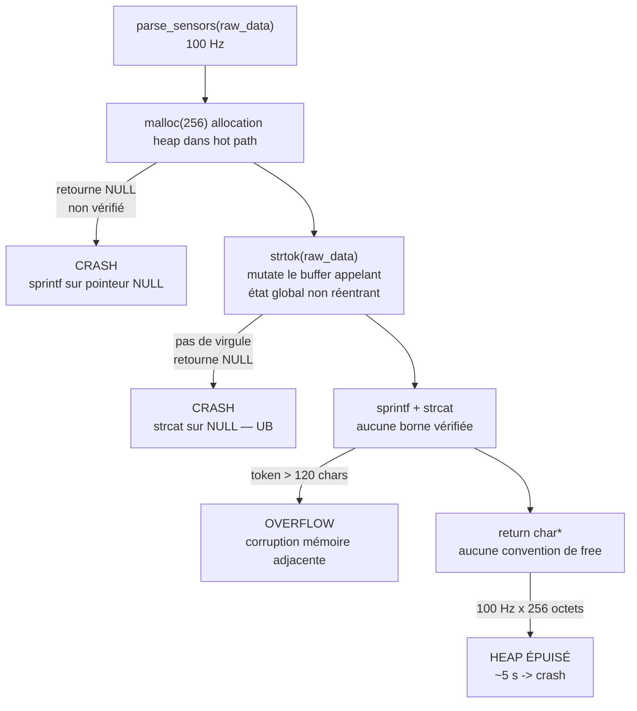

# Analyse — C++ Parser de capteurs embarqué

## Flux d'exécution et points de défaillance

## Tableau de sévérité

| # | Problème | Sévérité | Pourquoi | Symptôme observé |
| --- | --- | --- | --- | --- |
| 1 | `malloc` à 100 Hz sans `free` | Critique | 256 octets × 100 Hz = heap de 128 KB saturé en ~5 s | Crash après ~10 s |
| 2 | `strcat`/`sprintf` non bornés | Critique | Un token > 120 chars déborde le buffer et écrase la mémoire adjacente | Corruption mémoire aléatoire |
| 3 | Retour NULL de `malloc` et `strtok` non vérifié | Critique | Sur input sans virgule ou mémoire épuisée, on passe un NULL à strcat/sprintf — comportement indéfini | Crash sur input malformé |
| 4 | `strtok` mutate le buffer de l'appelant | Sévère | `strtok` remplace les séparateurs par `\0` in-place — toute réutilisation de `raw_data` après l'appel produit des données tronquées | Données corrompues en aval |
| 5 | `strtok` non réentrant (état global) | Sévère | `strtok` stocke son état dans une variable globale statique — deux appels simultanés (interruption, RTOS) la corrompent sans signal d'erreur | Corruption silencieuse sous interruption |
| 6 | Signature `char*` — ownership ambigu | Modéré | L'appelant ne sait pas qu'il doit `free()` le pointeur retourné — la fuite est structurelle | Fuite garantie côté appelant |
| 7 | Aucune validation d'entrée | Modéré | NULL, chaîne vide ou absence de virgule produisent un comportement indéfini sans aucun message d'erreur | UB sur edge cases |
| 8 | Plages physiques non vérifiées | Faible | Une température de `9999.9` ou une humidité de `-5.0` passe sans erreur et empoisonne le système décisionnel | Valeurs aberrantes acceptées silencieusement |

## Pistes de correction par problème

| # | Piste |
| --- | --- |
| 1 | Supprimer `malloc` : recevoir un `char out[256]` en paramètre, alloué par l'appelant sur la stack. |
| 2 | Remplacer `sprintf`/`strcat` par `snprintf(out, sizeof(out), ...)` — borner chaque écriture. |
| 3 | Vérifier `if (!token) return ERROR_INVALID_INPUT;` immédiatement après chaque `strtok_r`. |
| 4 | Copier `raw_data` dans un buffer local (`char tmp[256]`), passer `tmp` à `strtok_r`. |
| 5 | Remplacer `strtok` par `strtok_r(str, ",", &saveptr)` — état local, réentrant. |
| 6 | Changer la signature en `int parse_sensors(const char *in, char *out, size_t len)` et retourner un code d'erreur. |
| 7 | Ajouter en tête de fonction : `if (!raw_data \|\| raw_data[0] == '\0') return ERROR_INVALID_INPUT;`. |
| 8a | Température : `if (temp < -40.0 \|\| temp > 85.0) return ERROR_TEMP_OUT_OF_RANGE;` |
| 8b | Humidité : `if (hum < 0.0 \|\| hum > 100.0) return ERROR_HUM_OUT_OF_RANGE;` |
