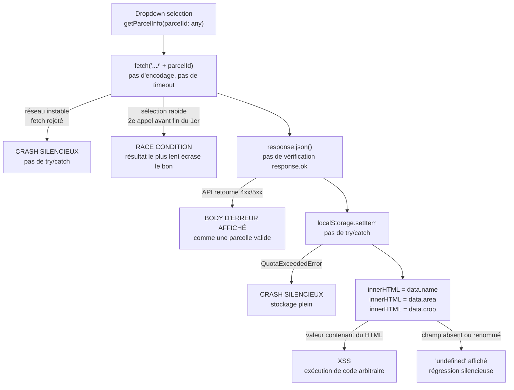

# Analyse — TypeScript API Parcelles

## Flux d'exécution et points de défaillance

## Tableau de sévérité

| # | Problème | Sévérité | Pourquoi | Symptôme observé |
| --- | --- | --- | --- | --- |
| 1 | XSS via `innerHTML` | Critique | Les valeurs de l'API sont injectées comme du HTML brut — un champ malveillant exécute du code arbitraire dans le navigateur | Exécution de code arbitraire |
| 2 | Pas de gestion d'erreur réseau | Critique | `fetch` lève une exception sur réseau instable — sans `try/catch` elle se propage silencieusement et l'UI se fige | Crashes fréquents en zone rurale |
| 3 | `response.ok` non vérifié | Critique | `fetch` ne rejette pas sur 4xx/5xx — le body d'erreur est parsé et affiché comme une parcelle valide | Données d'erreur affichées |
| 4 | Race condition sur sélections rapides | Sévère | Deux `fetch` en parallèle sans `AbortController` — le plus lent à terminer écrase les données du bon | Mauvaise parcelle affichée |
| 5 | Aucun cache | Sévère | Chaque sélection, même répétée, déclenche un appel réseau complet malgré `localStorage` disponible | Lenteur, surcharge API |
| 6 | URL non encodée — path traversal | Sévère | `parcelId: any` concaténé brut — une valeur comme `../../admin` altère la cible de la requête | Path traversal possible |
| 7 | `getElementById` peut retourner `null` | Modéré | Si l'élément HTML est absent, `.innerHTML` sur `null` lève un `TypeError` non géré | Crash silencieux |
| 8 | `localStorage.setItem` non wrappé | Modéré | `setItem` lève `QuotaExceededError` si le quota (~5 MB) est dépassé — exception non catchée | Crash sur stockage plein |
| 9 | Typage faible (`any` partout) | Modéré | `parcelId: any` et `data` implicitement `any` — un renommage de champ API produit `undefined` affiché sans erreur TypeScript | Bugs silencieux sur changement d'API |
| 10 | Pas de timeout | Faible | Sur 4G rural, une requête peut rester pending indéfiniment — aucun `AbortController` avec délai | Interface bloquée sans fin |
| 11 | Pas de feedback utilisateur | Faible | Aucun indicateur de chargement, aucun message d'erreur — l'utilisateur ne sait pas si l'UI répond | UX dégradée |
